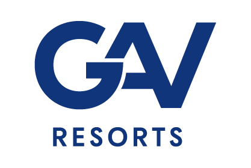

  

## Processo Seletivo para oportunidade de vaga Goiânia-GO C# Dev Junior

## Projeto ASP NET CORE API WEB usando o conceito MSC – Model Service Controller: Implementando cadastro básico de contatos com autenticação e autorização de endpoints com uso de chave JWT

## 🚀 Tecnologias

Esse projeto foi desenvolvido com as seguintes tecnologias:

- HTML
- CSS
- JavaScript
- C#

Bibliotecas

- [Font Awesome](https://fontawesome.com/)
